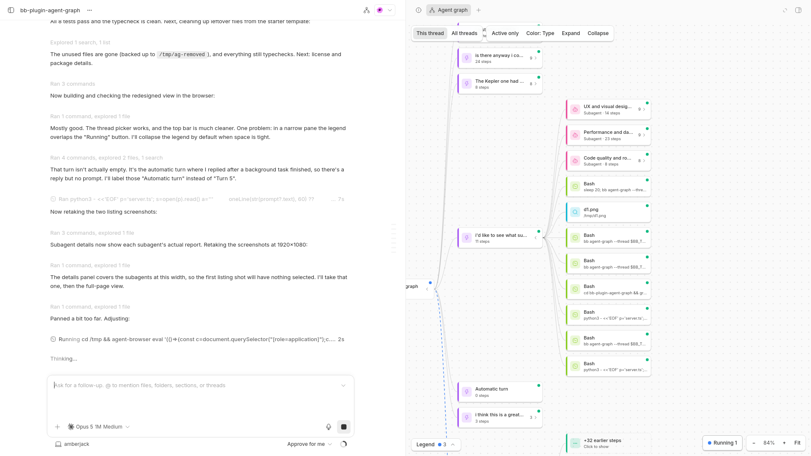

# Agent Graph for bb

See what every [bb](https://getbb.app) agent is doing, as a live map.

Agent Graph draws your projects, threads, turns, tool calls, subagents and
workflow agents as a graph that updates while agents work. Instead of scrolling
through logs to find out what a subagent is up to, you glance at the map. Click
any node to see what it did.



Inspired by the Agent Graph in GitKraken's
[Kepler](https://gitkraken.com/kepler).

## Install

In bb, open **Extensions**, search for **Agent Graph** and click Install.

Or from a terminal:

```sh
bb plugin install agent-graph
```

Requires bb 0.41 or newer.

## How it works

The graph reads left to right:

```
Agents → Project → Thread → Turn → Tool call
                                 → Subagent → its tool calls
                                 → Workflow → workflow agents
                          → Child thread → …
```

- **Turns** are labeled with the prompt that started them. A turn with no
  prompt, where the agent was woken by a background task, is labeled
  "Automatic turn".
- **Subagents** show their own tool calls nested inside. Their details show the
  report they handed back to the parent agent.
- **Child threads**, such as threads spawned by another thread, sit under their
  parent.

### Colors

By default, nodes are colored **by type**:

| Type | Color | | Tool call | Color |
| --- | --- | --- | --- | --- |
| Project | indigo | | Shell | lime |
| Thread | sky blue | | File edit | amber |
| Turn | purple | | Read / search | cyan |
| Subagent | pink | | Web | blue |
| Workflow | teal | | Other tool | slate |

Each tool type also has its own icon, and a dot in the corner of every card
shows its status.

Switch to **Color: Status** in the toolbar to color by status instead: running
(blue), needs input (amber), queued (violet), done (green), error (red),
interrupted (orange) or idle (grey).

In both modes, running work pulses and has animated edges leading into it.
Errors get a solid red border, and nodes waiting for your input get a dashed
amber one.

## Where it shows up

### The Agent Graph page

**Agent Graph** in the sidebar shows every thread active in the last 12 hours,
plus anything running, grouped by project.

To talk to an agent while you watch, select its node and choose **Chat beside
graph**, or double-click it. That thread's chat, reply box included, opens in
the page's right panel. Before you pick one, that panel lists your recent
threads.

### Beside any thread

Click the graph icon in a thread's header to open the graph in the right
panel. Switch between **This thread** and **All threads** at the top. The
graph remembers your choice.

### From the command line

```sh
bb agent-graph                  # every recently active thread
bb agent-graph --thread <id>    # one thread, its turns, subagents and child threads
bb agent-graph --json           # machine-readable output
```

This prints the same graph as a text tree, so agents can check what their
sibling agents are doing.

## Controls

| Action | How |
| --- | --- |
| See a node's details | Click it |
| Open a thread's chat | Double-click any of its nodes |
| Collapse or expand | The chevron on a card, or **Expand** / **Collapse** in the toolbar |
| Show hidden tool calls | Click "+N earlier steps" |
| Pan | Drag, or scroll |
| Zoom | ⌘/ctrl + scroll, pinch, or `+` / `-` |
| Fit to view | `0`, or **Fit** |
| Jump to running work | `J`, or the **Running** button (click again to cycle) |
| Hide finished work | **Active only** |
| Close details | `Esc` |

Finished turns and subagents start collapsed so the graph opens on what's
happening now. Long runs of tool calls fold into "+N earlier steps".

## Settings

Open **Settings → Agent Graph**, or use `bb plugin config agent-graph`:

| Setting | Default | What it controls |
| --- | --- | --- |
| Overview window (hours) | 12 | How far back the overview looks for active threads |
| Max threads in overview | 20 | The most threads the overview shows |
| Turns per thread in overview | 1 | How many recent turns each thread shows in the overview |
| Turns in single-thread view | 8 | How many recent turns the thread view shows |

Changes apply right away.

## Privacy and permissions

- Agent Graph reads your threads, projects and timelines through the bb plugin
  SDK. It never sends them anywhere else and makes no outside network requests.
- It has no secrets or API keys.
- It stores only a few view preferences (color mode, graph scope, the thread
  you last chatted with) in your browser's local storage.
- Chatting beside the graph uses bb's own chat component, with the thread's
  normal permission settings.

## Troubleshooting

- **A thread is missing from the overview.** It may be older than the overview
  window, or past the thread limit. Raise either in Settings, or open the
  thread and use its graph button.
- **The graph looks stale.** It refreshes on every change and every 15 seconds
  while visible. If a refresh fails, a message with a **Retry** button appears.
- **Everything is collapsed.** Click **Expand** in the toolbar, or press `J` to
  jump to running work.

## Develop

```sh
git clone https://github.com/nathancolgate/bb-plugin-agent-graph.git
cd bb-plugin-agent-graph
npm install
bb plugin install .   # install from this folder
bb plugin dev         # rebuild and reload on every save
```

Checks:

```sh
npm test              # unit tests for the layout and timeline grouping
npm run typecheck
npm run build
```

Code map:

| File | What it does |
| --- | --- |
| `server.ts` | Builds the graph from bb thread timelines, pushes live updates, and adds the `bb agent-graph` command |
| `timeline.ts` | Groups timeline rows into turns |
| `layout.ts` | Lays out the tree and folds long runs of tool calls |
| `graph.tsx` | The graph view: cards, edges, pan and zoom, details panel |
| `app.tsx` | Registers the sidebar page, side panels and header button |
| `shared.ts` | Constants and helpers used by both the backend and the frontend |

Issues and pull requests are welcome.

## License

[MIT](LICENSE) © Nathan Colgate
